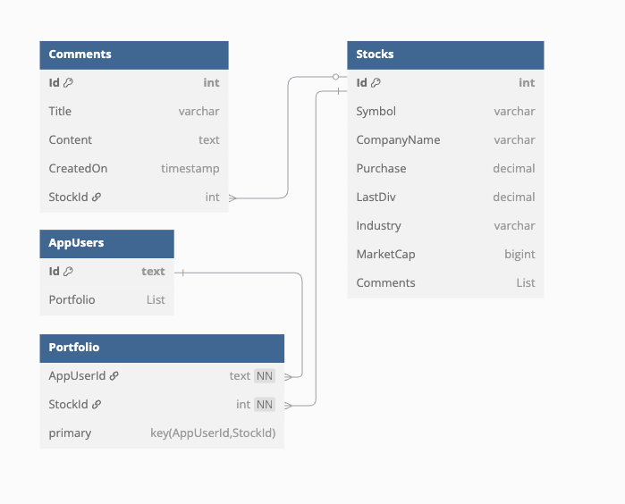
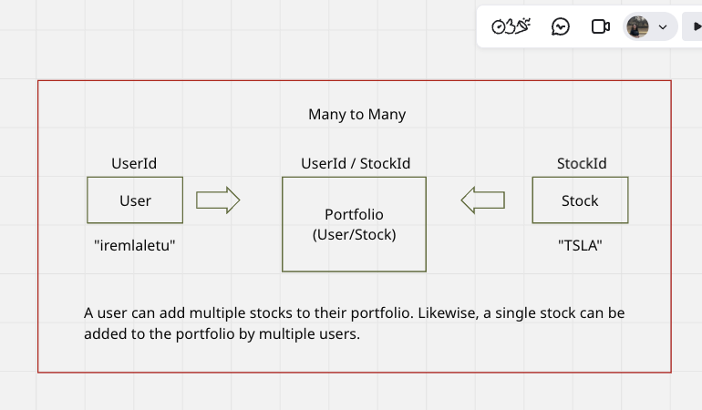
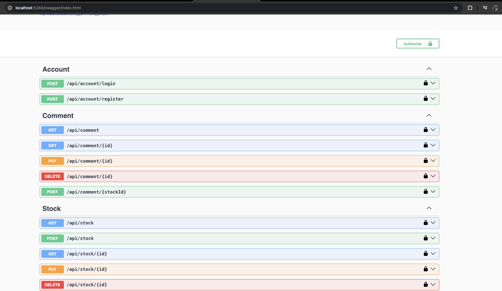
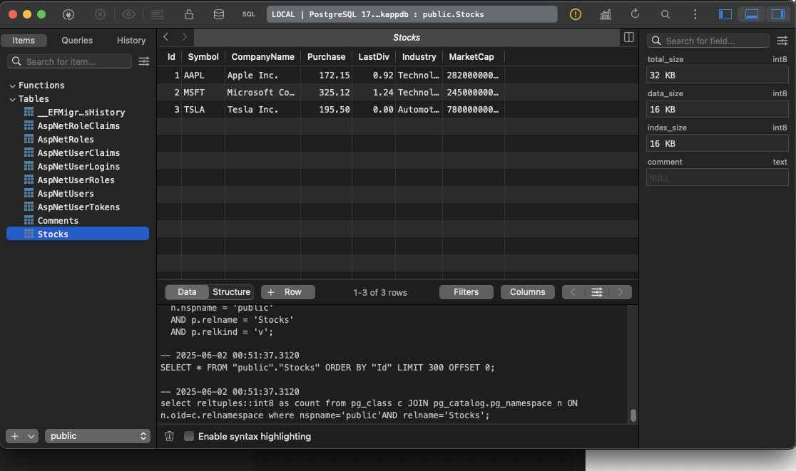

##  Stock Management API
A RESTful API for managing stocks, comments, and user authentication, built with ASP.NET Core, Entity Framework Core, and JWT authentication.

---

### **Features**

- **User Authentication** with JWT (Register / login) 
- **Stock Management** CRUD with **filtering, sorting, and pagination**.
- **Comment System**: CRUD with attached to stocks
- **Role-based Authorization** (Admin / User ).
- **DTO Validation** with DataAnnotations.
- **Swagger/OpenAPI** for testing endpoints
- **PostgreSQL** as the Database backend.
- **Clean Architecture** Separation of concerns with Controllers, Services, Repositories, DTOs, Mappers, and Interfaces.

---

### **Project Structure**

| Folder / File  | Description                                    |
| -------------- | ---------------------------------------------- |
| `Controllers/` | API endpoints (`Account`, `Stock`, `Comment`)  |
| `Data/`        | `AppDBContext` and database config             |
| `Dtos/`        | DTOs used for requests/responses               |
| `Helpers/`     | Helper classes like `QueryObject`              |
| `Interfaces/`  | Abstractions for repositories/services         |
| `Mappers/`     | Extension methods for entity-DTO mapping       |
| `Models/`      | Domain entities: `Stock`, `Comment`, `AppUser` |
| `Repository/`  | EF Core-based data access implementations      |
| `Service/`     | Business logic (e.g., `TokenService`)          |
| `Program.cs`   | App startup and service registration           |

---

**Prerequisites- Packages**

- .NET 9+ SDK
- PostgreSQL
- Docker for containerized DB → working on

---

### **API Overview**

**Authentication**

- **POST** /api/account/register — Register a new user.
- **POST** /api/account/login — Login and receive a JWT token.

**Stocks**

- **GET** /api/stock — List all stocks (supports filtering, sorting, pagination).
- **GET** /api/stock/{id} — Get a stock by ID.
- **POST** /api/stock — Create a new stock.
- **PUT** /api/stock/{id} — Update a stock.
- **DELETE** /api/stock/{id} — Delete a stock.

**Comments**

- **GET** /api/comment — List all comments.
- **GET** /api/comment/{id} — Get a comment by ID.
- **POST** /api/comment/{stockId} — Add a comment to a stock.
- **PUT** /api/comment/{id} — Update a comment.
- **DELETE** /api/comment/{id} — Delete a comment.

---

## **Entity Relationships**

- **User ↔ Stock → many-to-many** (via Portfolio) → A user can have many stocks in their portfolio, and a single stock can belong to multiple users' portfolios. This relationship is modeled through the Portfolio join table.
- **Stock ↔ Comment → one-to-many** → A single Stock can have many Comments. Each Comment is linked to only one Stock (via StockId).
- **User ↔ Portfolio → one-to-many** → One AppUser can have multiple Portfolio entries.
- **Stock ↔ Portfolio → one-to-many** → One Stock can appear in multiple Portfolio entries

---

### **Validation**

- DTOs use DataAnnotations for validation (e.g., [Required], [MaxLength], [Range]).
- Invalid requests return 400 Bad Request with validation errors.

---

### **Security - Token Service**

- JWT Bearer tokens are used for securing endpoints.
- Roles (Admin, User) are enforced in code.
- Password complexity rules applied via Identity.
- The TokenService is responsible for generating secure JWT tokens after a successful user login. These tokens include basic user claims such as username and email, and are signed using a secret key defined in appsettings.json.

---

### **Development Notes & Gotchas**

- **Entity Tracking for Updates** → Why no mapper in UpdateAsync()? Entity Framework Core tracks the original entity in memory. If you replace it with a new instance, EF can't detect changes.
 
- **Cascade Delete** → Deleting a stock with comments throws an error unless you use: `.OnDelete(DeleteBehavior.Cascade);`
 
- **Case-insensitive search** → PostgreSQL is case-sensitive by default. used EF.Functions.ILike() for searches like:
`.Where(s => EF.Functions.ILike(s.Symbol, $"%{query.Symbol}%"))`
 
- **JWT in Swagger** → JWT Bearer added to Swagger for testing secured endpoints.
    `option.AddSecurityDefinition("Bearer", new OpenApiSecurityScheme { ... });`
 
- **EF Warning: Non-deterministic seed** → If you use Guid.NewGuid() or DateTime.Now in HasData(), EF complains. Use static values instead.
 
- **ClaimsPrincipal Extension** → Adds a helper method to extract the username (givenname claim) from the authenticated user's JWT token.
    `
        public static string GetUsername(this ClaimsPrincipal user)
        {
            return user.Claims.SingleOrDefault(x => x.Type.Equals("http://schemas.xmlsoap.org/ws/2005/05/identity/claims/givenname")).Value;
        }
    `
    Usage example on controller `var username = User.GetUsername();`
 

